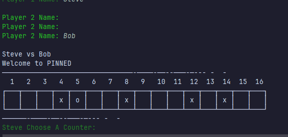
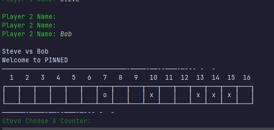
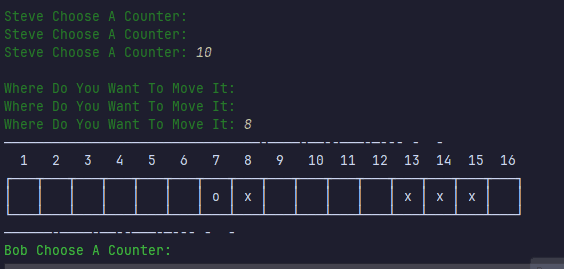

# Results of Testing

The test results show the actual outcome of the testing, following the [Test Plan](test-plan.md)

---

## Example Test Name

Checking for valid name data

### Test Data Used

inputting invalid and valid name data

### Test Result

The test went perfect and no flaws

---

## Example Test Name

checking for blank inputs when choosing counters

### Test Data Used

inputting blank data and vaild data into choosing counters

### Test Result

the test went as planned

---

## Example Test Name

Checking for vaild counter pick

### Test Data Used

inputting invalid and vaild data for choosing what counter to move

### Test Result

the tests went great with no bumps

---

## Example Test Name

checking for correct code for moving counters

### Test Data Used

inputting data on blank sqaures with counters in the way, and squares with a counter

### Test Result

test went smooth it was working as expected

---

## Example Test Name

testing switching between player i.e. player turns

### Test Data Used

inputting data

### Test Result

---

