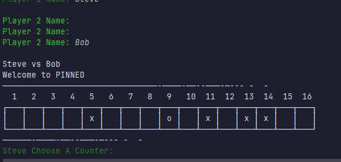
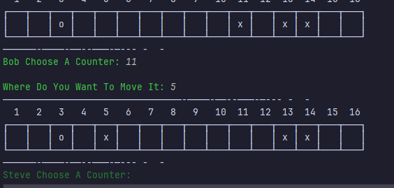

# Results of Testing

The test results show the actual outcome of the testing, following the [Test Plan](test-plan.md)

---

## Name Test

Checking for valid name data

### Test Data Used

inputting invalid and valid name data

### Test Result

The test went perfect and no flaws, names couldnt be blank

---

## Counter-Blank test

checking for blank inputs when choosing counters

### Test Data Used

inputting blank data and valid data into choosing counters

### Test Result

the test went as planned, when blanks were entered it would re-ask

---

## Picking counter test

Checking for valid counter pick

### Test Data Used

inputting invalid and valid data for choosing what counter to move

### Test Result

the tests went great with no bumps, when putting anything else other than a number it would re ask

---

## Moving counter test

checking for correct code for moving counters

### Test Data Used

inputting data on blank squares with counters in the way, and squares with a counter

### Test Result

test went smooth it was working as expected, with it not allowing it to move when there were counters in the way and on the square

---

## Player turns test

testing switching between player i.e. player turns

### Test Data Used

playing the game by inputting correct data

### Test Result

players took turns with no problem

---

## Player removes counters

removing x counters of square one

### Test Data Used

inputting data to remove off square 1

### Test Result

players took turns with no problem

---

## Player wins test

testing when o counter is removed game is ended

### Test Data Used

removing o counter off square 1

### Test Result

players won with no problem

---
